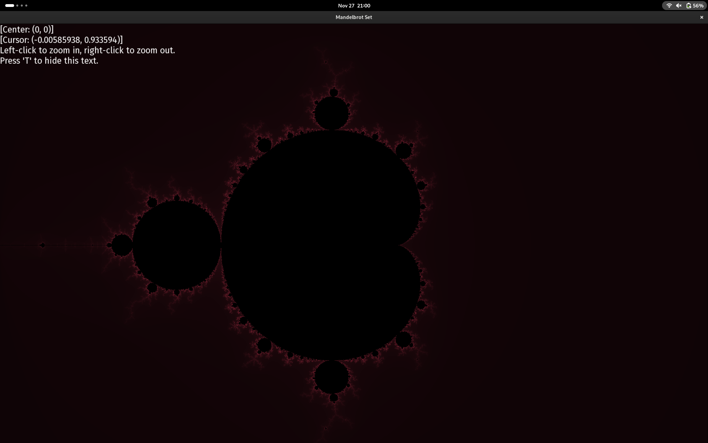

<h1 align="center"> Mandelbrot Set</h1>

---

<h3 align="center"> Features </h3>

- C++ implementation using [SFML](https://www.sfml-dev.org/)
- Greyscaled Mandelbrot set 
    - Note: outer-most points are RGB(5, 5, 5) whilst the set itself is RGB(0, 0, 0).
- Uses threading and the squared magnitude of a complex number for efficiency 
- Ability to toggle the text HUD to enter a pseudo 'photo' mode

<h3 align="center"> Extras </h3>

This project was made for the CISP 400 class at American River College. As per the Linux assignment requirements, this project was tested, built and ran on my 2020 MacBook Pro running the [Asahi Linux](https://asahilinux.org/) kernel version 6.10-6.